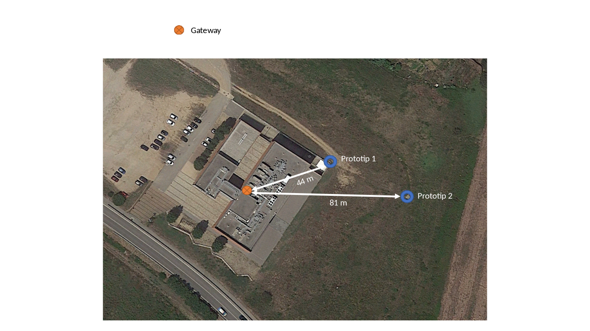
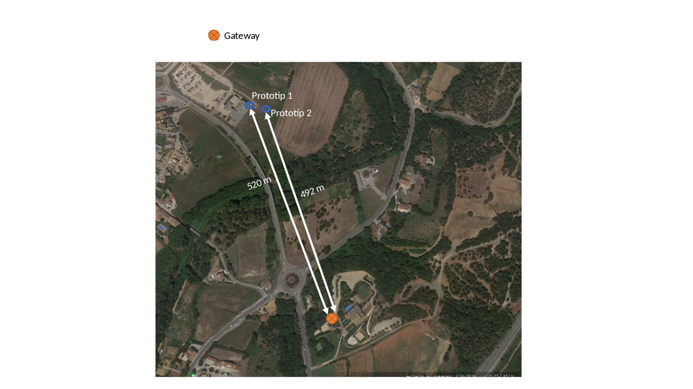

## Proves comunicació LoRa
- Data: 02/05/2019
- Lloc: icra (voltants)
- Servidor: http://lora.h2793818.stratoserver.net/

| id wasp (node) | canal LoRa | localització nodes |
|------|--------|------|
| 5e0a | 868-13 | exterior, sota una tapa davant L05 (44 m fins al D01) |
| 5f83 | 868-14 | exterior, sota una tapa davant L05 (81 m fins al D01) |

Observacions:

Per fer les proves s'han mantingut fixes els nodes 5e0a i 5f83 i s'han anat
movent els receptors (gateways).

S'han pogut rebre dades a una distància màxima de 500 m (sense obstacles) amb
bona recepció de dades. Per tant, per a una bona comunicació és més important que
<b>no hi hagi edificis/obstacles entre node i gateway</b> més que no pas la distància entre node i gateway.

També s'ha observat que dins el cotxe empitjorava la comunicació. Si deixàvem
l'antena gateway a sobre el cotxe, la recepció de dades era bona. 

Per tant, quan instal·lem els gateways hem de mirar que hi hagi molts pocs o
cap obstacle, i si cal, millorar la comunicació afegint un pigtail i
posant-la a l'exterior.

